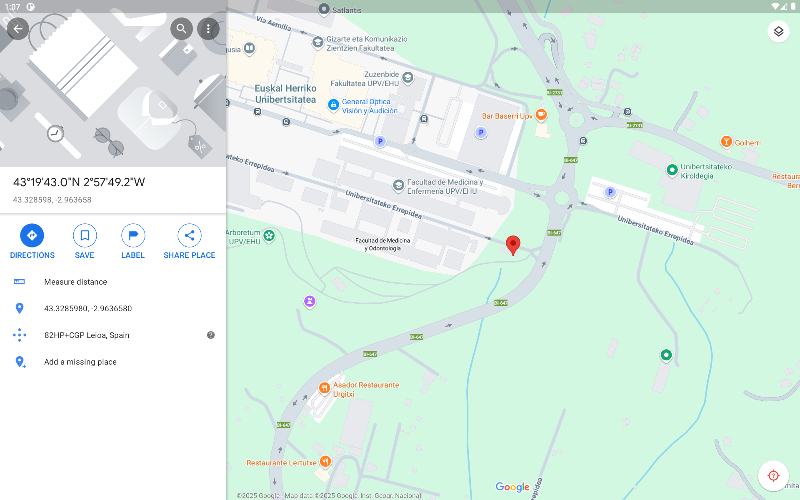

# Arboretum

> Aplicación Android sencilla para ubicar árboles en el Arboretum de UPV/EHU

## Recursos

- [Página de referencia de UPV/EHU](https://www.ehu.eus/es/web/bizkaia/arboretuma)

- El icono de la aplicación se ha diseñado con [IconKitchen](https://icon.kitchen/i/H4sIAAAAAAAAAzWQT2%2FDIAzFv4t3zaHdUmnKtYddJ623aZoMGMJGcERIq6rqd69NWw78eTz%2FeOYCR0wrLTBcwGH5P4w0EQwe00Id%2BLBPccZS9XohWcCRxzVV6CBaziLQxH%2FxN2NdC8G1AxMO51kQEAq6SFmtJnw8DwKynLhsxfHSW%2FS7jRia9KrSu7FvPYqEOSTB9Dth%2BvCJzsUctLzyDMN200GJYRSgbg3XytN9n8g3tdXtFaxc30bL8jViC2hjsfKE2h6R7aNbKZ3YrUn%2F5VuSuMLRacu8yHwiAz%2FXG%2FYlCls6AQAA).
